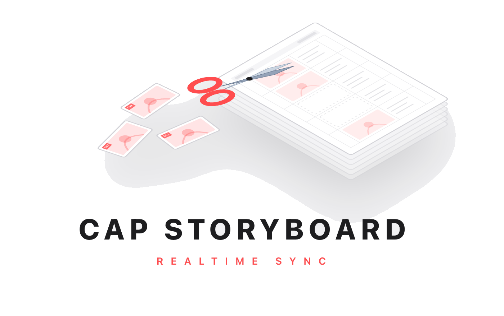

<p align="center">
  
</p>

<h1 align="center">CapStoryBoard</h1>

<p align="center">
  <b>把 CSP 分镜实时同步到剪映时间线的桌面工具。</b><br>
  在 Clip Studio Paint 中绘制分镜稿 → 保存即自动切片 → 落入剪映工程。
</p>

<p align="center">
  <a href="https://github.com/XiaoChu-1208/capstoryboard-releases/releases/latest">
    
  </a>
  
  
</p>

<p align="center">
  <a href="https://github.com/XiaoChu-1208/capstoryboard-releases/releases/latest"><b>📦 下载最新版安装包</b></a> ·
  <a href="mailto:chizhu1208@163.com"><b>📧 联系作者购买兑换码</b></a>
</p>

---

## ✨ CapStoryBoard 能做什么

| | |
|---|---|
| 🎨 **CSP 分镜原稿一键切片** | 在 Clip Studio Paint 里画好分镜稿，保存即自动按格切成单镜 PNG + 自动命名（S1C001 …） |
| 🎬 **直接灌入剪映** | 切片完成的图片会自动复制到当前剪映工程的素材库 + 按顺序铺到时间线 |
| 👁️ **OCR 镜号识别** | 读取你画在草稿格里的 `C01`/`C02` 标记，按你写的镜号排序，不用手动调 |
| 📦 **打包出 PDF / ZIP** | 一键导出可发给制片/导演审稿的横/竖屏 PDF 故事板 + 资产包 |
| 🔒 **完全离线** | 激活后 100% 本地运行，剧本/草稿/工程文件**永远不离开你的电脑** |

---

## 📦 下载安装

到 [Releases 页](https://github.com/XiaoChu-1208/capstoryboard-releases/releases/latest) 下载最新 `CapStoryBoardSetup-X.Y.Z.exe`，双击运行即可，**无需 Python 或其他依赖**。

> 系统要求：Windows 10 / 11（64-bit）。WebView2 运行时（Win11 内置；Win10 通过 Microsoft Edge 自动更新已默认安装）。

---

## 💳 购买流程

CapStoryBoard 是付费软件。

1. **邮件联系作者**：📧 `chizhu1208@163.com`，说明购买意向 + 你的微信/支付宝
2. **完成付款** → 作者会**当场为你签发一张 18 位兑换码**：
   ```
   CSB-A3F1-X8K2-9VBM
   ```
3. 下载安装包，**在安装向导的"激活授权"页粘贴这张兑换码**
4. 安装程序自动联网激活（约 2 秒），**把这张密钥绑定到你的设备**
5. 之后每次启动 App **完全离线**，再也不需要联网

> ⚠️ **重要**：兑换码会**锁定到你第一次激活的电脑**。换电脑/换硬件后需要联系作者重新申请。

---

## 🧭 安装步骤详解

### 第 1 步：双击 `CapStoryBoardSetup-X.Y.Z.exe`

按现代化安装向导一路走：欢迎 → **输入授权码**（重点） → 选择安装目录 → 释放部署 → 完成。

默认安装到 `%LocalAppData%\Programs\CapStoryBoard`，无需管理员权限。

### 第 2 步：在「输入授权码」页粘贴兑换码

把作者发给你的整段 `CSB-XXXX-XXXX-XXXX` 直接粘到输入框，格式校验通过即可下一步。

### 第 3 步：完成安装并启动

安装完成后双击桌面快捷方式，App **自动联网完成绑定**（一次性，约 2 秒）。
之后所有功能立即可用，**全程离线运行**。

---

## 🔑 关于密钥

| 问 | 答 |
|---|---|
| 兑换码能在多台电脑上用吗？ | **不能**。每张兑换码会锁定到首次激活的设备，转给朋友也无法激活。 |
| 我换电脑了怎么办？ | 联系作者申请一张新兑换码，原来的那张作废。 |
| 我重装系统/重装 App？ | 通常 MAC 地址不变 → 设备指纹不变 → 直接用旧的 license 文件即可，无需联系。如果重装后激活报错，按"换电脑"流程申请新码。 |
| 哪里能看激活信息？ | 启动 App 后 → 偏好设置（齿轮图标）→ 授权信息 |
| 卸载并重装会丢激活吗？ | 不会。激活信息存在 `%USERPROFILE%\.capstoryboard\license.json`，卸载不会动它。 |

---

## 🔄 自动更新

App 启动时会**自动检查新版本**（仅拉取本仓库一个 5KB 的 `manifest.json`，**无任何遥测**）。

- 有新版可用时，欢迎页右上角会出现一个红色向上箭头角标
- 点击它会弹出版本说明，可选择「前往下载」跳转到 Releases 页
- 下载新安装包覆盖安装即可，**无需重新激活**

---

## ❓ 常见问题

### 安装向导报"兑换码格式不正确"

请检查：
- 兑换码是否完整（包含 `CSB-` 前缀，共 18 个字符）
- 是否漏掉了短横线（应为 `CSB-XXXX-XXXX-XXXX` 形式）
- 是否多了空格、换行（建议从作者邮件直接复制）
- 兑换码**不含**字母 `I`、`O` 和数字 `0`、`1`（设计上规避易混淆字符）

### App 首次启动时报"激活失败：兑换码不存在"

兑换码无效，可能：
- 输入有误（多/少字符）
- 兑换码已被作废（请联系作者）
- 你的网络无法访问 `storycut.work`（请暂时关闭 VPN / 代理重试）

### App 报"此密钥已绑定其他设备"

兑换码已经在另一台电脑上激活过了。请按"换电脑"流程联系作者申请新码。

### App 报"无法连接激活服务器"

可能：
- 网络问题（防火墙、代理、断网）
- 服务器临时维护（极少发生）
- 请重试 / 换网络环境再试 / 联系作者

### 我能否退款？

请直接邮件联系作者沟通。

---

## 📨 联系方式

- **邮箱**：chizhu1208@163.com
- **问题反馈**：在本仓库 [Issues 页](https://github.com/XiaoChu-1208/capstoryboard-releases/issues) 提出（推荐附 App 版本号 + 错误截图）

---

## 🔒 隐私

CapStoryBoard 是一款基本离线的工具：

- **不收集任何使用数据**，不上报任何遥测
- 你的 CSP、PSD、剪映草稿、绘画内容**永远不会**离开本机
- **激活时**会通过 HTTPS 把你的兑换码 + 本机设备指纹（8 位十六进制哈希）发到作者的服务器一次，用于绑定。这是激活流程的必需操作
- 启动时会拉取本仓库的 `manifest.json`（5KB 的版本号清单）用于检查更新；无任何账号/用户信息

---

## 📜 License

CapStoryBoard 是商业付费软件。本仓库提供的安装包受作者版权保护，未经书面许可不得反编译、二次分发或集成进其他产品。
