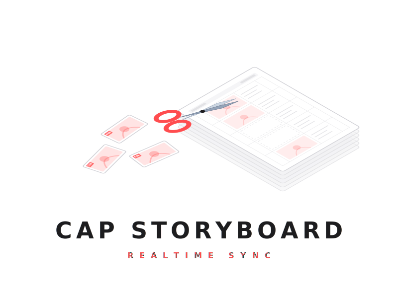
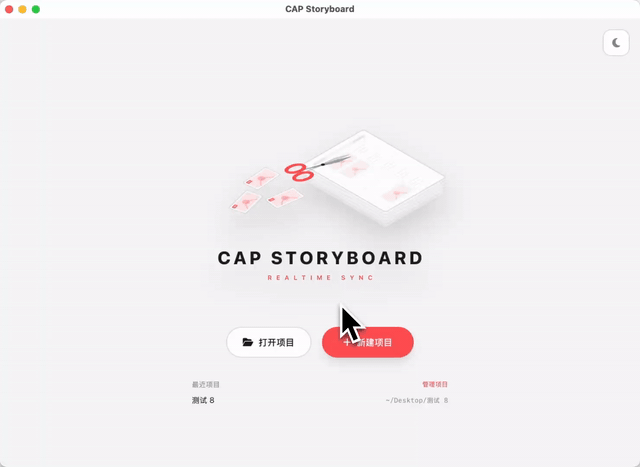

<p align="center">
  
</p>

<p align="center">
  
</p>

<p align="center">
  
</p>

<h1 align="center">CapStoryBoard</h1>

<p align="center">
  <b>边画分镜，边在剪映里实时看动态预览 —— PSD 到剪映的实时分镜预演工具</b>
</p>

<p align="center">
  一键生成带网格的分镜纸 PSD 模板，并同步建好一个剪映草稿（占位画面已按顺序铺进时间线）。
  你用 Clip Studio Paint / Photoshop 在格子里画分镜、顺手写上每镜时长，
  <b>每次保存 PSD</b>，CapStoryBoard 就自动把每格裁成画面、按你写的时长更新到剪映时间线 ——
  切回剪映即可看到分镜按节奏播放的动态预览（animatic），不用导出、不用改名、不用手动拖拽。
</p>

<p align="center">
  <a href="https://github.com/XiaoChu-1208/capstoryboard-releases/releases/latest">
    
  </a>
  
  
  
</p>

<p align="center">
  <a href="https://github.com/XiaoChu-1208/capstoryboard-releases/releases/latest"><b>下载最新版安装包</b></a> ·
  <a href="mailto:chizhu1208@163.com"><b>邮件联系作者购买兑换码</b></a> ·
  <a href="#常见问题"><b>常见问题</b></a> ·
  <a href="#技术架构与隐私">技术架构</a>
</p>

---

## 目录

- [适用人群与典型场景](#适用人群与典型场景)
- [核心功能](#核心功能)
- [工作流详解](#工作流详解)
- [系统要求](#系统要求)
- [下载与安装](#下载与安装)
- [购买流程](#购买流程)
- [兑换码与设备绑定](#兑换码与设备绑定)
- [自动更新机制](#自动更新机制)
- [常见问题](#常见问题)
- [技术架构与隐私](#技术架构与隐私)
- [作者与联系方式](#作者与联系方式)
- [版权与授权](#版权与授权)

---

## 适用人群与典型场景

CapStoryBoard 面向**要做动态分镜（animatic）的创作者**：分镜师、动画 / 短片 / MV / 广告导演、漫画作者、短视频策划。核心价值是把"画分镜"和"在剪映里看分镜按时间轴动起来"这两件事**实时打通** —— 你边画边存，剪映里立刻按你标的节奏播放。

| 你现在怎么做 | 用 CapStoryBoard |
|---|---|
| 在 PS / CSP 画完分镜 → 按格手工导出几十张 PNG → 一张张拖进剪映 → 一条条调时长 → 想改一格又得重导一遍 | 一键建好 PSD 模板 + 剪映草稿；在格子里画、顺手写时长；**保存即同步**到剪映时间线，改一格存一下，剪映里那一镜立刻更新 |
| 用静态 PDF / 九宫格图当分镜，看不出真实节奏 | 直接在剪映时间线上**按时长播放**，所见即最终成片的镜头节奏（animatic 动态预览） |
| 反复在「画图软件 ↔ 剪辑软件」之间手动搬运、命名、对齐 | 全程自动：裁切、命名、铺轨、时长，一次都不用手动碰 |

如果你符合下面任何一条，这工具就是为你做的：

- 习惯用 **Clip Studio Paint / Photoshop**（任何能存 PSD 的软件）画分镜
- 用**剪映专业版**做动态分镜 / 预演 / 剪辑
- 希望分镜**改一笔，剪映里立刻看到效果**，而不是反复手动导出
- 不想把分镜稿和创意上传到任何云端 / 在线分镜平台

---

## 核心功能

### 1. 一键生成分镜纸 PSD 模板 + 配套剪映草稿

新建项目时，选好画幅比例，CapStoryBoard 一次性生成：

- 一个**带网格的分镜纸 PSD 模板**（每页 5 格，格子带锁定标记防误移）
- 一套**占位 PNG 序列**（每格一张）
- 一个**剪映草稿**，占位画面已按顺序铺进时间线

打开模板直接在格子里画即可，画布尺寸 / 网格 / 剪映工程都已经替你建好对齐。

### 2. 保存 PSD 即自动裁切同步

CapStoryBoard 后台监控你的 PSD 文件。每次按 `Ctrl+S` 保存：

- 自动检测哪些格子**已经画了内容**（空占位格跳过）
- 按格坐标裁切成单镜 PNG（命名 `C-01`、`C-02` …）
- **覆盖更新**对应占位 PNG —— 剪映时间线上那一镜随之刷新
- 改哪格更新哪格，秒级完成，不用导出、不用改名、不用重新拖拽

### 3. 手写时长 OCR → 同步剪映片段时长

在格子里**手写每镜时长**（如 `3s`、`5`）：

- 内置 **RapidOCR** 离线引擎识别手写时长数字
- 自动把识别到的秒数写到剪映时间线对应片段的时长上
- 对常见手写误读做了宽松兜底（如 `3s`→`35` 的纠偏、≤10s 上限保护）
- 于是剪映里的分镜**按你画在纸上的节奏播放**，真正的动态预演

### 4. 四种画幅比例

- 横屏：**16:9**（1920×1080）、**4:3**
- 竖屏：**9:16**（1080×1920）、**3:4**
- 横竖屏自动切换对应的模板布局与剪映工程画布

### 5. 完全离线运行

激活后**所有处理都在本机完成**：PSD 解析、画面裁切、OCR 时长识别、剪映草稿读写，全程不联网。
你的分镜稿、剧本、剪辑工程**永远不会**上传到任何服务器。

---

## 工作流详解

### 第一次：新建项目

1. 启动 App → 新建项目，选画幅比例（16:9 / 4:3 / 9:16 / 3:4）
2. CapStoryBoard 自动生成：分镜纸 PSD 模板 + 占位 PNG 序列 + 剪映草稿（占位画面已铺好时间线）
3. App 缩到系统托盘（Win）/ 菜单栏（Mac），开始监控这个项目的 PSD

### 日常：边画边存

1. 用 Clip Studio Paint / Photoshop 打开生成的 PSD 模板
2. 在格子里画分镜，在格子里手写每镜时长（如 `3s`）
3. 按 `Ctrl+S` 保存
4. CapStoryBoard 托盘 / 菜单栏图标短暂闪动（秒级处理：裁切 + OCR 时长 + 写回剪映草稿）
5. 切到剪映 → 时间线上的分镜画面已更新、时长已按你写的调好 → 直接播放看动态节奏

改了某一格：再存一次，**只更新那一格**对应的画面与时长，剪映里跟着变。

### 在剪映里出片

分镜画好、节奏在剪映里调顺后，剪映工程本身就是你的动态分镜成品 —— 可以直接在剪映里继续配音、加字幕、套真实素材，或导出视频作为 animatic 交付。

---

## 系统要求

| 项目 | Windows | macOS |
|---|---|---|
| 操作系统 | Windows 10 (1903+) / Windows 11，64-bit | macOS 12 Monterey 及以上（Intel / Apple Silicon 通吃） |
| 内存 | 4 GB+（推荐 8 GB） | 同左 |
| 磁盘 | 安装包占 100-120 MB，运行缓存约 200-500 MB | 同左 |
| 运行时 | WebView2（Win11 内置；Win10 经 Edge 自动安装） | WKWebView（系统内置，无需任何额外安装） |
| 必需软件 | 任意能编辑 / 保存 PSD 的软件（Clip Studio Paint、Photoshop、Krita 等）+ 剪映专业版 | 同左 |
| 网络 | 仅首次激活约 2 秒，之后完全离线 | 同左 |

---

## 下载与安装

到 [Releases 页](https://github.com/XiaoChu-1208/capstoryboard-releases/releases/latest) 下载对应平台的安装包。两个平台**走完全一致的 5 步 Cine Bright 安装向导**（左侧 CSP+剪映同源插图，右侧 5 步进度，第 2 步粘贴兑换码），UI/UX 一比一。

### Windows

1. 下载 `CapStoryBoardSetup-X.Y.Z.exe`，双击运行
2. 5 步向导：
   - **欢迎页** → 点"开始部署"
   - **输入授权码** → 粘贴 `CSB-XXXX-XXXX-XXXX` 兑换码
   - **选择安装目录** → 默认 `%LocalAppData%\Programs\CapStoryBoard`，无需管理员权限
   - **释放部署** → 实时进度条 + 安装日志（约 5-10 秒）
   - **完成** → 勾选"立即启动 CapStoryBoard"
3. 桌面 + 开始菜单自动创建快捷方式

### macOS

1. 下载 `CapStoryBoardSetup-vX.Y.Z.dmg`，双击挂载
2. **直接双击磁盘里的 `CapStoryBoardSetup` 图标运行**（它是安装程序，**不用**拖到「应用程序」文件夹；首次启动若被 Gatekeeper 拦截，去「系统设置 → 隐私与安全」点「仍要打开」再双击一次）
3. 走与 Windows 完全一致的 5 步向导：第 2 步粘贴兑换码，第 3 步默认安装到 `/Applications`，无需 sudo
4. 向导完成后会把 **CapStoryBoard 本体**装进 `/Applications`，可勾选"立即启动"；之后从启动台 / 应用程序文件夹打开即可（安装器已自动清 `com.apple.quarantine` 属性，正常无需再点 Gatekeeper）
5. 装完可以退出并删除安装器、推出磁盘镜像
6. 卸载：双击 `~/.capstoryboard/uninstall.command` 一键清理

> **macOS 首次打开被拦截？**（"无法打开，来自身份不明的开发者" / "已损坏，应移到废纸篓"）
> 这是 Gatekeeper 对未签名 app 的正常拦截，**文件没问题**。最快解法：**右键点 `CapStoryBoardSetup` → 打开 → 再点「打开」**。
> 详见下方 [常见问题 → macOS Gatekeeper](#常见问题)。

### 卸载

通过 Windows "应用与功能" → "CapStoryBoard" → 卸载。
卸载**不会**删除你的激活信息（`%USERPROFILE%\.capstoryboard\license.json`），重装后无需重新激活。

---

## 购买流程

CapStoryBoard 是**买断制付费软件**（一次性付费，永久使用，无订阅）。

### 完整购买步骤

1. **发送购买意向邮件**到作者邮箱 `chizhu1208@163.com`
   - 邮件主题建议写：`CapStoryBoard 购买咨询`
   - 邮件内容请说明：你的用途（个人 / 工作室）、是否需要发票、希望的支付方式（微信 / 支付宝 / 银行转账）
2. **作者回复价格 + 付款信息**（通常当天回复）
3. **完成付款** → 把付款凭证截图发回邮件
4. **作者当场签发 18 位兑换码**，邮件回复给你，形如：
   ```
   CSB-A3F1-X8K2-9VBM
   ```
5. **下载安装包** → 在安装向导第 2 步「输入授权码」粘贴上面的兑换码
6. **完成安装** → App 首次启动会通过 HTTPS 联网完成绑定（约 2 秒），**绑定到你这台电脑**
7. 之后所有功能本地可用，**完全离线**

### 试用与退款

- **暂未提供试用版本**。如需了解功能细节，可以邮件向作者要演示视频
- **退款**请在购买后 **7 天内**邮件申请，未激活的兑换码全额退款；已激活的按使用情况协商

---

## 兑换码与设备绑定

CapStoryBoard 采用**设备指纹绑定的离线激活机制**：每张兑换码会锁死在第一次激活的电脑上，**不能转给朋友、不能在多台机器同时用**。

### 兑换码格式说明

- 18 个字符（含 2 个连字符）
- 形如 `CSB-XXXX-XXXX-XXXX`
- 字符集 32 字符：`A-Z 2-9`，**不含**易混字符 `I` / `O` / `0` / `1`
- 每张兑换码**全网唯一**，由 Upstash Redis 维护一致性

### 设备绑定原理

激活时 App 会计算本机的设备指纹（MAC 地址 + 主机名 + 平台标识 SHA-256 哈希前 4 字节 → 8 位十六进制）发到作者的服务器一次。
服务器用 Ed25519 私钥签发一张**只有这个设备指纹能用**的离线许可证（`license.json`），写入本机后**永久离线运行**。

### 关于密钥的常见疑问

| 问 | 答 |
|---|---|
| 兑换码能在多台电脑上用吗？ | **不能**。每张兑换码会锁定到首次激活的设备指纹。 |
| 我换电脑了怎么办？ | 联系作者邮件说明，作废原码并补发一张新码。这是正常售后流程。 |
| 我重装了 Windows？ | 通常 MAC 地址不变 → 指纹不变 → 直接用原 `license.json` 即可。如果激活报错，按"换电脑"流程申请新码。 |
| 我换了网卡 / 装了独立网卡？ | MAC 变了 → 指纹变了 → 需要联系作者重发新码。 |
| 卸载并重装会丢激活吗？ | **不会**。`license.json` 在 `%USERPROFILE%\.capstoryboard\`，不在程序目录里，卸载不动它。 |
| 哪里能看激活信息？ | 启动 App → 偏好设置（齿轮图标） → 授权信息 |
| 我能否反编译 / 二次分发？ | **不可以**，详见 [版权与授权](#版权与授权)。 |

---

## 自动更新机制

App 启动时会自动检查新版本：

- 从本仓库 `main` 分支拉取一个 5 KB 的 [`manifest.json`](https://github.com/XiaoChu-1208/capstoryboard-releases/blob/main/manifest.json)
- 比对 `latest` 字段与本机版本号
- 有新版可用时，**欢迎页右上角会出现红色向上箭头角标**
- 点击角标会弹出版本说明 + "前往下载"按钮，跳转到本仓库 Releases 页

### 隐私保证

- 检查更新**只发一次 HTTPS GET 请求**到 GitHub Raw CDN，**不携带任何账号 / 用户 / 机器信息**
- 不上报 App 版本 / 操作系统 / IP 等任何遥测数据
- 可以在偏好设置里关闭自动检查

### 升级方式

下载新版安装包 → 覆盖安装 → 完成。
**无需重新激活**，原 `license.json` 自动保留。

---

## 常见问题

### 安装阶段

#### Q: 安装向导报"兑换码格式不正确"

检查清单：
- 兑换码完整 18 个字符，含 `CSB-` 前缀
- 包含 2 个短横线，应为 `CSB-XXXX-XXXX-XXXX` 形式
- 没有多余空格 / 换行（从作者邮件**复制时 Ctrl+A 全选邮件正文容易带换行**，建议双击只选兑换码本身）
- **不含**字母 `I`、`O` 和数字 `0`、`1`（设计上规避混淆字符）

#### Q: 安装向导启动后白屏或闪退

可能原因：缺少 WebView2 运行时。

解决方案：
1. 打开 Microsoft Edge → "关于" → 让 Edge 自动更新到最新（会顺带装 WebView2）
2. 或手动安装：https://developer.microsoft.com/microsoft-edge/webview2/
3. 装完后重新运行安装包

#### Q: 安装到 `C:\Program Files\` 失败

CapStoryBoard 默认装到 `%LocalAppData%\Programs\CapStoryBoard`，**不需要管理员权限**。
如果你手动改到 `Program Files`，需要在弹出的 UAC 提示中点"是"授权。
**不推荐改默认路径**，除非你有运维理由。

#### Q:（macOS）双击安装器报"无法打开，因为它来自身份不明的开发者"

这是 macOS Gatekeeper 对**未经 Apple 付费签名**的应用的默认拦截，**不是病毒、也不是文件损坏**。CapStoryBoard 是独立开发者作品，未购买 Apple 开发者签名（99 美元/年），所以会被拦一下。放行方法二选一：

- **方法一（推荐，最快）**：在访达里**右键**（或按住 Control 单击）`CapStoryBoardSetup` 图标 → 选「打开」→ 弹窗里再点一次「打开」。之后这个 app 就被永久放行。
- **方法二**：先双击一次（会被拦），然后去 **系统设置 → 隐私与安全性**，往下拉到「安全性」，会看到一行"已阻止 CapStoryBoardSetup..."，点右边的 **「仍要打开」**，再回去双击。

#### Q:（macOS）报"已损坏，无法打开，您应该将它移到废纸篓"

这是 **Apple Silicon (M 系列)** 上对从网络下载的未签名 app 的常见误报 —— `com.apple.quarantine` 隔离属性 + 无签名触发的。**文件没坏**。两种解法：

- **图形方式**：同上「右键 → 打开」通常也能绕过
- **终端一行解决**（最稳）：打开「终端」，粘贴执行（路径按实际拖入）：
  ```bash
  xattr -cr /Volumes/CapStoryBoard\ Setup/CapStoryBoardSetup.app
  ```
  然后再双击运行即可。

> 说明：安装器内部在释放 CapStoryBoard 本体时**已自动执行 `xattr -dr com.apple.quarantine`**，所以装好后的主程序通常不会再有这个问题；上面的操作只针对**安装器本身**第一次启动。

### 激活阶段

#### Q: App 首次启动报"激活失败：兑换码不存在"

可能：
- 兑换码输入有误（多 / 少字符 / 大小写）
- 兑换码已被作废（请邮件联系作者核对）
- 你的网络无法访问 `storycut.work`（HTTPS 端点）

排查：
1. 暂时关闭 VPN / 代理（部分代理会拦截）
2. 在浏览器打开 https://www.storycut.work 看是否能正常访问
3. 不行的话联系作者，提供你的设备指纹（启动 App 时报错提示里会显示）

#### Q: App 报"此密钥已绑定其他设备"

这张兑换码已经在另一台电脑激活过了。按 [换电脑流程](#兑换码与设备绑定) 联系作者申请新码。

#### Q: App 报"无法连接激活服务器"

可能：
- 网络问题（防火墙 / 代理 / 断网）
- 服务器临时维护（极少发生）
- 请重试 / 换网络环境 / 联系作者

### 使用阶段

#### Q: 保存了 PSD，剪映里画面没更新

排查：
1. 确认 App 显示"监控中"状态、且监控的是当前这个项目的 PSD
2. 确认你画的格子里**确实有内容**（完全空白的占位格会被跳过）
3. 确认 PSD 真的保存成功（部分软件需要按合并保存，而非另存新文件）
4. 剪映工程需要重新打开 / 刷新一下读取更新后的占位 PNG

#### Q: 手写时长没被识别 / 识别错了

OCR 对工整的数字识别最准。建议：
- 时长写在格子里清晰位置，用数字 + `s`（如 `3s`、`5s`）
- 字写大一点、工整一点，避免连笔
- 单镜时长上限按 10 秒保护（写更长可在剪映里手动拉）
- 没写时长的格子会用默认时长，可在剪映里手动调

#### Q: 想换画幅比例怎么办

画幅比例在**新建项目时**确定（16:9 / 4:3 / 9:16 / 3:4），它决定 PSD 模板布局和剪映工程画布。换比例请新建一个项目。

### 法务与商务

#### Q: 可以申请退款吗？

可以。购买 7 天内未激活的兑换码可**全额退款**；已激活的按使用情况协商。
退款申请请邮件 `chizhu1208@163.com`，主题 "CapStoryBoard 退款申请"。

#### Q: 可以开发票吗？

可以。请在购买时邮件说明，备注公司名 / 税号 / 收件邮箱。

#### Q: 团队 / 工作室批量购买有折扣吗？

5 张及以上批量购买有折扣，详询作者邮箱。

---

## 技术架构与隐私

### 软件构成

CapStoryBoard 由两部分构成：

1. **桌面应用**（本仓库分发）—— Windows `.exe` / macOS `.app`，PyInstaller 单文件打包
   - GUI 层：pywebview（Windows 用 WebView2 / macOS 用 WKWebView）
   - 业务层：Python 3.12，主要依赖 psd-tools（PSD 解析）、Pillow（裁切渲染）、watchdog（PSD 保存监听）、pyJianYingDraft（剪映草稿读写）、rapidocr-onnxruntime（手写时长 OCR）、pystray（托盘/菜单栏）、PyNaCl（Ed25519 验签）
   - PSD 裁切 / OCR / 剪映草稿读写全走本地 CPU，不调用任何云端 API
2. **激活服务**（作者私有部署）—— Vercel + Upstash Redis
   - 作用：根据兑换码查询订单记录，签发**绑定到设备指纹的**离线许可证
   - 仅在**首次激活那一次**通讯，之后客户端与服务端**完全没有通讯**

### 数据流

激活时（一次性）：
```
客户端                          作者服务器
  │                                │
  │  POST /api/license/activate    │
  │  { code, device_id }           │
  │ ─────────────────────────────> │
  │                                │  查 Upstash 验证 code
  │                                │  Ed25519 签发 license
  │                                │
  │  { license: "CSB-... (long)" } │
  │ <───────────────────────────── │
  │                                │
  │  本地验签 + 写 license.json    │
  │  (从此完全离线)                │
```

激活后（永久）：
- 客户端**不再向作者服务器发送任何请求**
- 除非用户主动检查更新（GET 一个 5KB 的 manifest.json，不带任何用户信息）

### 隐私承诺

CapStoryBoard 不收集、不上报、不传输以下数据：

- 你的 PSD 分镜稿内容 / 裁切出的 PNG / 任何中间产物
- 你的剪映草稿工程 / 视频素材
- 任何使用统计 / 错误堆栈 / 崩溃日志
- 你的网络 IP、操作系统版本、硬件信息
- 任何可识别你身份的元数据

唯一会离开本机的数据：
- **激活时**：你的兑换码（你已经知道）+ 8 位十六进制设备指纹（MAC + 主机名 + 平台的 SHA-256 哈希前 4 字节，**不可逆，不含个人信息**）
- **检查更新时**：拉取一个公开的 5KB JSON，**不携带任何 header / body 个人信息**

### 反盗版

- 兑换码经 Ed25519 签名绑定到设备指纹，**反编译客户端也无法生成新码**（私钥从不离开作者本机）
- 验签发生在客户端本地，**断网也无法绕过**（签名校验是数学保证，不是服务端口令）
- 你的同事 / 朋友拿你的 `license.json` 也用不了，因为他们的设备指纹对不上

### 开源情况

- 本仓库（capstoryboard-releases）**公开**：包含 README、banner、manifest、release 安装包
- 源代码仓库（capstoryboard）**不公开**：商业软件，源码保留作者所有权
- Ed25519 验签代码可在反编译产物中查阅（出于透明度，验签逻辑就是公开标准）

---

## 作者与联系方式

CapStoryBoard 由独立开发者 **小刍 (XiaoChu-1208)** 开发并维护。

- **作者邮箱**: chizhu1208@163.com（购买 / 退款 / 售后 / 反馈，**通常 24 小时内回复**）
- **问题反馈**: 本仓库的 [Issues 页](https://github.com/XiaoChu-1208/capstoryboard-releases/issues)（推荐附 App 版本号 + 错误截图 + 操作步骤）
- **作者主页**: https://github.com/XiaoChu-1208

### 在做但还没发的功能

- macOS 版本（计划中）
- Toon Boom Harmony / TVPaint / Procreate 工程对接（看反馈）
- 团队协作 / 工作室共享分镜库（看反馈）
- 多剪映工程同时监控（v0.2 计划）

如果你对某个功能有强烈需求，欢迎发邮件投票。

---

## 版权与授权

CapStoryBoard 是商业付费软件，著作权归作者所有。

**允许的行为**：
- 个人 / 团队购买后自用
- 评测 / 推荐 / 引用（请注明出处 + 链接）
- 学习目的反编译查看激活流程实现

**禁止的行为**：
- 未授权分发安装包 / 兑换码
- 移除 / 篡改激活逻辑后二次分发
- 把 CapStoryBoard 的功能集成进其他商业软件
- 利用本软件搭建二次盈利的在线服务

商务合作 / OEM 授权请直接邮件联系作者。

---

<p align="center">
  <sub>Copyright © 2026 XiaoChu-1208. All rights reserved.</sub><br>
  <sub>关键词：剪映动态分镜 · animatic 工具 · 分镜预演 · PSD 分镜模板 · Clip Studio Paint 分镜 · 剪映草稿自动生成 · 实时分镜同步 · 离线分镜工具 · storyboard animatic for JianyingPro · Windows / macOS 桌面分镜软件</sub>
</p>
